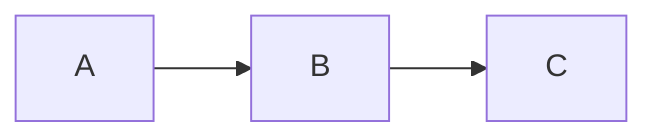

# Tufte Hugo Theme

A Hugo theme based on Edward Tufte's distinctive typography style.

**Demo**: [kizoo.gitlab.io](https://kizoo.gitlab.io)

## History

This is a fork of [loikein/hugo-tufte](https://github.com/loikein/hugo-tufte), which itself evolved through:

1. [shawnohare/hugo-tufte](https://github.com/shawnohare/hugo-tufte) (original)
2. [slashformotion/hugo-tufte](https://github.com/slashformotion/hugo-tufte)
3. [loikein/hugo-tufte](https://github.com/loikein/hugo-tufte)

This fork aims to restore styles closer to the original [tufte-css](https://github.com/edwardtufte/tufte-css) while keeping Hugo integration improvements.

## Changes from loikein/hugo-tufte

### Restored to Original tufte-css

| Item | Original tufte-css | loikein fork | This fork |
|------|-------------------|--------------|-----------|
| Sidenote numbering | CSS counter | Hugo Scratch | CSS counter |
| h2/h3 margin-bottom | 1.4rem | 0 | 1.4rem |
| h2 margin-top | 2.1rem | 5.5rem | 2.1rem |
| font-display | swap | missing | swap |
| Math rendering | MathJax | KaTeX | MathJax 3 |
| body width | 87.5% | removed | 87.5% |
| subtitle selector | `p.subtitle` | `.subtitle` | `p.subtitle` |
| epigraph margin | 5em | 3em | 5em |
| blockquote width | 55% | 50% | 55% |
| blockquote margin-right | 40px | removed | 40px |
| list width | 50% | 45% | 50% |
| list item spacing | 0.25rem | 0.5rem | 0.25rem |
| link underline | offset + thickness | removed | restored |
| code font-size | 1.0rem | 1.125rem | 1.0rem |
| pre > code overflow-x | auto | scroll | auto |
| .sans > code | 1.2rem | removed | 1.2rem |
| pre.fullwidth > code | width: 90% | removed | width: 90% |
| table-wrapper overflow-x | auto | scroll | auto |
| 760px body padding | 84%, 8% | removed | restored |
| 760px blockquote margin | 1.5em 0 | removed | restored |
| 760px label cursor | pointer | removed | pointer |

### Why These Changes?

**Sidenote CSS Counter**

The original tufte-css uses CSS counters for sidenote numbering:

```css
body { counter-reset: sidenote-counter; }
.sidenote-number { counter-increment: sidenote-counter; }
.sidenote-number:after { content: counter(sidenote-counter); }
```

loikein switched to Hugo's `.Scratch` for server-side numbering. However, this was likely a workaround for a KaTeX conflict—KaTeX CSS overwrites `body`'s `counter-reset`, breaking sidenote numbering. By switching to MathJax 3, we can use the original CSS counter approach.

**h2/h3 Margin**

loikein merged h2 and h3 styles:

```scss
h2, h3 {
    font-style: italic;
    margin-bottom: 0;  /* was 1.4rem in original */
}
```

While more concise, this creates coupling between heading levels and loses the original spacing. We restored individual declarations with `margin-bottom: 1.4rem`.

**MathJax 3**

Switched from KaTeX to MathJax 3 because:
- KaTeX's CSS conflicts with sidenote counters
- MathJax 3 doesn't overwrite `body`'s `counter-reset`
- CDN primary with local fallback for reliability

### Other Improvements

- Client-side search with multi-language support (including CJK) via [FlexSearch](https://github.com/nextapps-de/flexsearch).
- `.author`, `.date` selectors scoped to `.content-meta` to prevent style leaks
- Separated blog-specific styles from tufte.scss core
- Mermaid diagram support (conditional loading)
- Back-to-top button (appears on scroll)
- Home page filters out `type: book` pages

## Installation

Requires Hugo Extended (for SCSS support).

```shell
cd your-site/themes/
git clone https://github.com/kizoo69/tufte.git
```

Add to your `config.yaml`:

```yaml
theme: 'tufte'
```

## Configuration

### Site Parameters

```yaml
params:
  subtitle: "Your subtitle"
  showPoweredBy: true
  copyrightHolder: "Your Name"
  math: true              # Enable MathJax site-wide
  codeBlocksDark: false   # Dark theme for code blocks
```

### Mermaid Diagrams

```yaml
params:
  mermaid:
    theme: neutral    # Mermaid theme
    themeCSS: |       # Optional custom CSS
      * { font-family: 'Mona Sans', sans-serif !important; }
```

Use fenced code blocks with `mermaid` language:

~~~markdown

~~~

Mermaid JS is loaded only on pages that use diagrams.

### Search

This theme includes client-side search functionality powered by [FlexSearch](https://github.com/nextapps-de/flexsearch), with support for multi-language content including CJK.

To enable it, add the following to your site configuration:

```yaml
params:
  search:
    enable: true
    # For CJK language support, FlexSearch requires custom configuration.
    # 'encode: false' is needed to prevent default encoding from interfering
    # with CJK tokenization. A custom 'tokenize' function (typically in JavaScript)
    # is also required to split CJK characters appropriately.
    # Refer to FlexSearch documentation for detailed CJK setup.
    encode: false
```

A search icon will appear in the header. The search index is automatically generated during the build process.

### Page Parameters

```yaml
---
title: "Post Title"
math: true      # Enable MathJax for this page
meta: true      # Show author/date metadata
toc: true       # Show table of contents
type: book      # Exclude from home page listing
---
```

## Shortcodes

- `sidenote` - Numbered side notes
- `marginnote` - Unnumbered margin notes
- `epigraph` - Opening quotations
- `blockquote` - Block quotations with attribution

See [tufte-features.md](exampleSite/content/posts/tufte-features.md) for examples.

## TODO

### Font & Accessibility
- [ ] Accessible font sizing (avoid base font-size, use relative units) - ref: [CSS-Tricks](https://css-tricks.com/accessible-font-sizing-explained/#aa-avoid-setting-a-base-font-size)
- [ ] Conditional CJK font loading (skip if not needed)
- [ ] Sans-fonts testing and configuration

### Features
- [ ] Details shortcode improvements
- [ ] Epigraph nowrap handling
- [ ] Mermaid diagram enhancements
- [ ] Dark/light theme toggle
- [ ] MathJax: LaTeX environments require backticks - see [ISSUE-mathjax-backticks.md](ISSUE-mathjax-backticks.md)

### Shortcode documentation
- [ ] cite shortcode demo/docs
- [ ] div shortcode demo/docs
- [ ] section shortcode demo/docs
- [ ] tag shortcode demo/docs
- [ ] youtube shortcode - loikein version not working, needs investigation

## License

MIT
