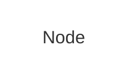

Hugo에서 Mermaid 다이어그램을 구현하면서 배운 내용 정리.

## 1. CDN vs Bundled (2025-10-07)

CDN 접근이 실패하고 번들 방식이 작동한 이유.

### CDN 시도 (실패)

```html
<script type="module">
  import mermaid from 'https://cdn.jsdelivr.net/npm/mermaid@11/dist/mermaid.esm.min.mjs';
  mermaid.initialize({ startOnLoad: true, theme: 'neutral' });
</script>
```
결과: "Syntax error in text, mermaid version 10.9.4"

### Bundled 방식 (성공)

Hextra 테마에서 번들 파일 복사 후 Hugo 리소스 파이프라인 사용:

```html
{{ if .Page.Store.Get "hasMermaid" }}
  {{- $mermaidJS := resources.Get "lib/mermaid/mermaid.min.js" | fingerprint -}}
  <script defer src="{{ $mermaidJS.RelPermalink }}" integrity="{{ $mermaidJS.Data.Integrity }}"></script>
  <script>
    document.addEventListener("DOMContentLoaded", function () {
      mermaid.initialize({ startOnLoad: true, theme: 'neutral' });
    });
  </script>
{{ end }}
```

### 성공 요인

1. **정확한 버전**: Mermaid 11.3.0 (테스트된 버전)
2. **Hugo 리소스 파이프라인**: fingerprint, SRI 해시
3. **Deferred 로딩**: DOM 준비 후 초기화
4. **조건부 로딩**: `hasMermaid` 플래그로 필요한 페이지만

---

## 2. Scoped Theming 시도 (2025-10-08)

`classDef` 중복 제거를 위한 시도.

### 문제

6개 다이어그램에 동일한 `classDef` 반복:
```mermaid
classDef site stroke: none, fill: none;
classDef section fill: none;
classDef group stroke: none, fill: none;
```

### 시도한 해결책

Front matter에서 `themeCSS` 정의:
```yaml
mermaid:
  themeCSS: |
    .site { stroke: none; fill: none; }
```

JavaScript에서 병합:
```javascript
const pageConfig = {{ .Params.mermaid | jsonify }};
Object.assign(config, pageConfig);
```

### 실패 원인

Hugo의 `jsonify`가 JSON을 이스케이프하여 문자열로 만듦:
```javascript
const pageConfig = "{\"themecss\":...}";  // 객체가 아닌 문자열
Object.assign(config, pageConfig);  // 실패
```

---

## 3. 수정 방법 (2025-10-26)

`jsonify`에 `safeJS` 추가하여 해결.

### 템플릿 측 병합

```go-html-template
{{- $siteConfig := dict "startOnLoad" true -}}
{{- $siteConfig = merge $siteConfig (dict "theme" (.Site.Params.mermaid.theme | default "neutral")) -}}
{{- with .Site.Params.mermaid.themeCSS -}}
  {{- $siteConfig = merge $siteConfig (dict "themeCSS" .) -}}
{{- end -}}

{{- $pageConfig := .Params.mermaid | default dict -}}
{{- $finalConfig := merge $siteConfig $pageConfig -}}

const config = {{ $finalConfig | jsonify | safeJS }};
mermaid.initialize(config);
```

---

## 4. 최종 결론

### themeVariables 사용 불가

Hugo `jsonify`가 키를 소문자로 변환:
- `fontFamily` → `fontfamily` (Mermaid가 인식 못함)

### 권장 구성

**hugo.yaml (전역)**:
```yaml
params:
  mermaid:
    theme: neutral
    themeCSS: |
      * { font-family: 'Mona Sans', sans-serif !important; }
```

**다이어그램별 classDef 유지**:


### 핵심 교훈

1. `jsonify` 사용시 항상 `safeJS` 추가
2. 템플릿에서 데이터 처리 후 JavaScript로 전달
3. `themeCSS`는 전역 스타일용, `classDef`는 다이어그램별 스타일용
4. 복잡한 추상화보다 단순한 중복이 나을 때도 있음
